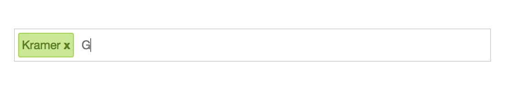

# vue-input-tag
> A Better Vue.js 2.0 input tag component inspired in [react-tagsinput](https://github.com/olahol/react-tagsinput), an improved version of [vue-input-tag](https://tucci.me/vue-input-tag)

[](https://travis-ci.org/Yproximite/better-vue-input-tag)
[](https://www.npmjs.com/package/better-vue-input-tag)
[](https://www.npmjs.com/package/better-vue-input-tag)

<p align="center">
  
</p>

## Installation

``` bash
npm install better-vue-input-tag --save
```

and in your component:

``` javascript
import BetterInputTag from 'better-vue-input-tag'
```

## Usage

``` html
<better-input-tag :on-change="callbackMethod" :tags="tagsArray"></better-input-tag>
```

## Props
| Name | Type | Default | Description |
| ---:| --- | ---| --- |
| tags | Array | [] | Tags to be render in the input |
| placeholder | String | "" | Placeholder to be shown when no tags |
| on-paste-delimiter | String | "" | During pasting, this delimiter is used to create multiple tags |
| read-only | Boolean | false | Set input to readonly |
| on-change | Function | undefined | Callback to get the tags when there is a change |
| validate | String | "" | Apply certain validator for user input. Choose from `email`, `url`, `text`, `digits` or `isodate` |
| length | Object | undefined | Set a minimum and/or maximum length for tags `{min: 1, max: 10}` |

**This project was built with [generator-vue-component](https://github.com/ianaya89/generator-vue-component) ❤️**

